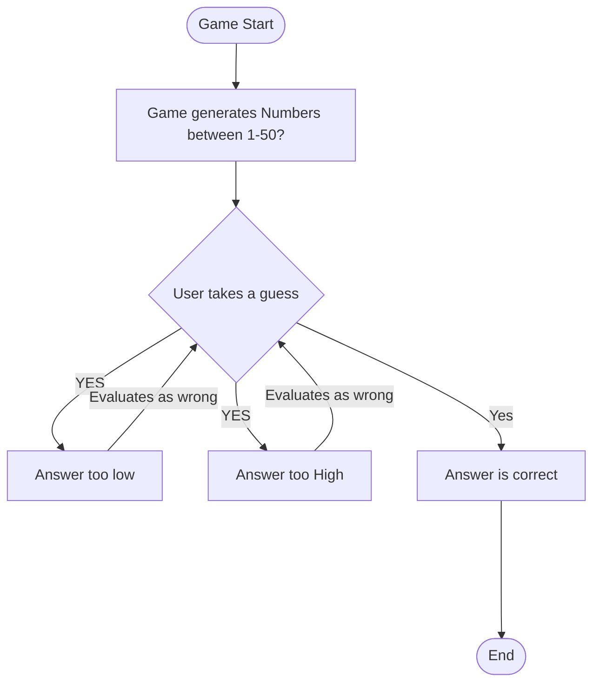

## Flowchart Steps
* Step 1: Start
* Step 2: Game generates the numbers typically between 1-50
* Step 3: The user is requested to input their answer
* The answer would be evaluated between 3 options
    * Too low
    * Too High
    * Correct
* If it is either too low or too high, the game loops back to Step 3 and user's input is requested again
* If it is correct that's where the game ends.
